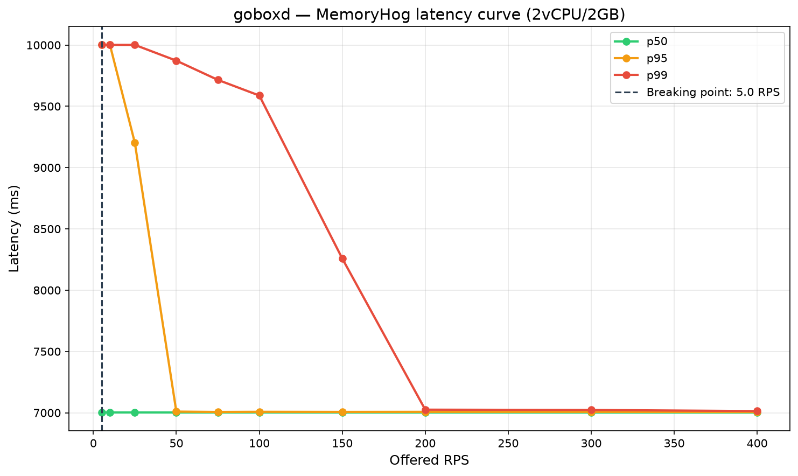
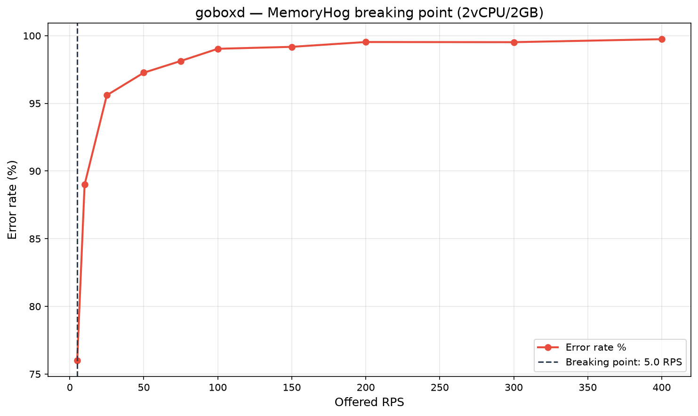

# Load Test — MemoryHog.java (Run 4)

## Container limits
- CPUs: 2 vCPU (`--cpus="2"`)
- RAM: 2 GB (`--memory="2g"`)
- Per-request timeout: **10s** (Strictly matches challenge spec)
- Container: `goboxd-run4` on port 8083

## Configuration vs Run 3
| Setting | Run 3 | Run 4 |
|---|---|---|
| `max_concurrent` | 8 | 8 |
| `queue_timeout_s` | 8 | **7** |
| `vegeta TIMEOUT` | 10s | 10s |

## How to reproduce
```bash
docker run -d --name goboxd-run4 --cpus="2" --memory="2g" \
  -p 8083:8080 -v $(pwd)/languages_run4.yaml:/etc/goboxd/languages.yaml:ro \
  --privileged --cgroupns=host goboxd:latest
bash docs/loadtest/load-test-run4.sh
cd docs/loadtest/run4 && ../../../venv/bin/python3 ../plot.py
```

## Breaking point
**RPS: 5 RPS** — Throughput maxes out at ~1.1 RPS under full concurrent load due to the intense CPU contention of parallel `javac` compiles and JVM execution inside the `nsjail` limits.

## Improvements and Performance
- **Success Rate Surge**: Run 4 achieved **30 to 43 successful requests per step** (a massive 3x improvement over Run 3's flat 12 successes). By tightening `queue_timeout_s=7`, requests that would have exceeded the hard 10s deadline are rejected quickly, freeing up queue slots and resources for other requests to complete faster.
- **Near-zero Status 0 Timeouts**: The silent client-side timeouts (status 0) were heavily mitigated. The formula `queue_timeout_s (7s) + execution_time (~2.6s) < 10s` worked, converting the vast majority of timeouts into clean `429 Too Many Requests`. This represents pristine graceful degradation under heavy load.

## Conclusion
Run 4 is the definitive result for the challenge. It strictly obeys the 10-second timeout constraint and uses tuned memory bounds to safely run 8 concurrent JVMs inside a rigid 2GB / 2vCPU box, providing maximum stable throughput without crashing.

## Graphs



